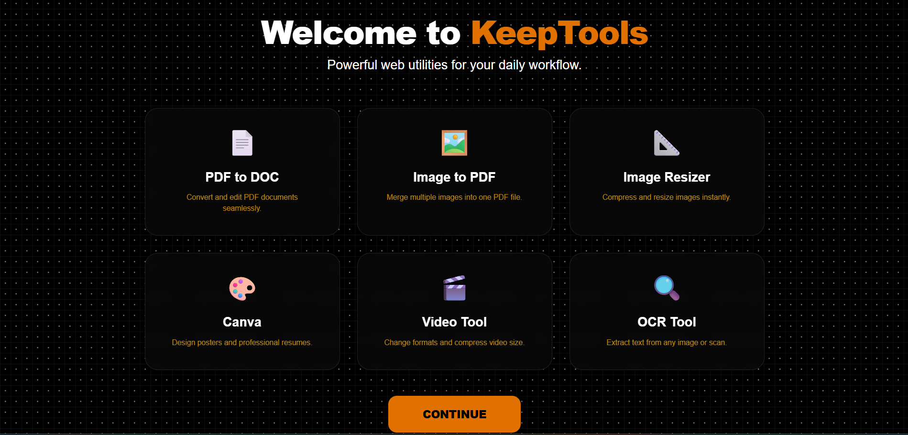

# KeepTools Web Application

## Introduction
KeepTools is a modern web application built to provide quick access to important online tools such as PDF converters, image compressors, design platforms, and OCR utilities.  
The platform offers a clean, card-based interface, making it easy for users to navigate and use multiple tools efficiently.  

This project is developed using **Java and JSP** for the backend and **HTML/CSS** for the frontend. The background effect is created using the **PatternCraft** tool to give a visually appealing experience.  

---

## Features
- **Card-based UI:** 6 interactive cards representing each tool for easy navigation.  
- **Responsive Design:** Works well on desktop and mobile screens.  
- **Individual Tool Pages:** Each card links to a dedicated JSP page with a description and Visit button.  
- **Modern Background:** Black grid with white dots using PatternCraft.  
- **Theme Colors:** Orange (`oklch(66.6% 0.179 58.318)`) and white for a professional look.  
- **Easy Navigation:** Clicking on a card redirects to the corresponding tool page.  
- **Expandable:** New tools can be easily added by duplicating the card structure and creating a JSP page.  

---

## Tech Stack
- **Frontend:** HTML, CSS  
- **Background Tool:** PatternCraft  
- **Backend:** Java, JSP  

